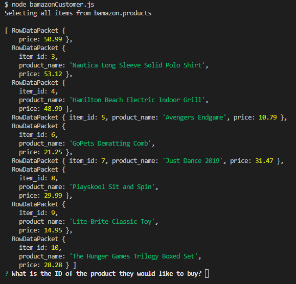
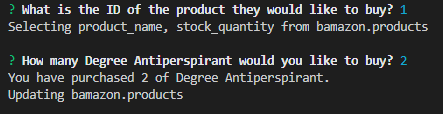

# bamazon
Amazon-like storefront using MySQL

## Contributor(s)
  * This application was created by `Ivor Wallace`.

## Instructions
  * The user will see what is in the store by an automatic select from the bamazon database.
  * The user will select the item ID of the product they would like to buy.
  * The user will select the quantity of the item they would like to buy.
  * If the product amount in stock is greater or equal to the user amount, then the database stock is reduced by that amount.
  * 
  * 
  

### Packages needed:
  * inquirer
  * promise-mysql
